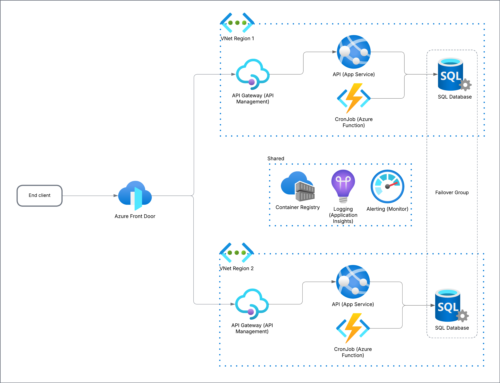
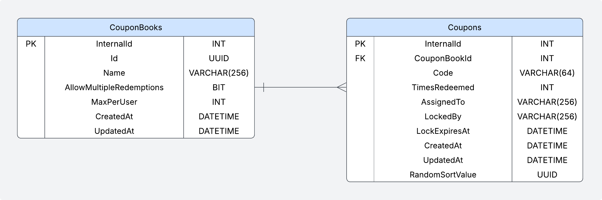

# Coupon Book Service 

## Overview

This is a design document describing the high-level architecture and API for a service that allows businesses to create, distribute, and manage coupons.

This service supports operations such as creating coupon books, assigning coupons to users, locking coupons temporarily during redemption attempts, and redeeming coupons

The original assumptions included:
- Coupon book codes can optionally be redeemed more than once per user (coupon book parameter level)
- Max number of codes per Coupon Book assigned per member can also be optionally specified (coupon book parameter level)

To those, the folowing assumptions were added:

- Coupon book names aren't unique.
- For simplicity purposes, a coupon can only be assigned to one user.
- Coupon codes can either be redeemed only once or infinity times.
- Coupon codes are unique even across coupon books.
- Locks need to expire after a certain time to prevent coupons to be perpetually locked but never redeemed.

### Possible improvements
In the future, the following features could be added for a more advanced and feature rich system.

- Allow multiple users to redeem the same code.
    - Useful for global campaings where a code can be used up to a certain amount of times, or until a specific date.
    - Would require not locking the code for a user and adding a mechanism to disable the code after amount of usages/expirtation time is reached.

## High Level System Architecture
Azure is used as cloud platform, but most services have an equivalent one in AWS/GCP - See [Azure for AWS professionals](https://learn.microsoft.com/en-us/azure/architecture/aws-professional/) or [Azure for GCP professionals](https://learn.microsoft.com/en-us/azure/architecture/gcp-professional/).



1. Front Door receives public requests and redirects it to the closest available region. Provides load balancing, health checking, DDOS protection, application firewall, among other things.
2. Requests are then forwarded to API Management. Provides endpoint consolidation on a single URL in case of multiple services, user level caching and rate limiting, cache invalidation capabilities, authentication, versioning, among other things.
3. Requests are then forwarded the API, which privately comunicates with the SQL database.

### Notes
- No budget contraints were considered for the architecture.
- APIs are containerized and each revision is stored in a container registry. The app service uses these containers to run the API.
- The cronjob will periodically update the SQL database to remove locks on coupons that weren't redeem after a certain amount of times.
    - To avoid heavy load on the database, a messaging queue could be implemented in the middle to update a one or a set of coupons at a time.
- App Services and Functions will have horizontal auto-scaling policies based on memory and CPU usage, with at least one instance always on to prevent cold start issues.
- App Services and Functions will make use of deployment slots in production to slowly redirect the traffic to a newest version of the API and services, monitoring for new issues and being able to quickly rollback if necesary.
- Production environment services should be zone-redundant when possible to prevent datacenter livel failures.
- At least 2 regions should be deployed in Production to protect against regional failures.
- For bigger projects App Service and Azure Functions could be replaced by AKS using deployments and cronjobs. This will be more flexible and will remove the dependency on cloud specific services, but at the cost of more management overhead.
- Caching can be done at the API gateway level. Since we only have one read related endpoint, coupons for a user, the data returned can be cached per user for that endpoint and the cache invalidated on API calls that perform write operations related to that user.
    - If more fine-grained cache control is needed an external cache like Redis can be added.
- An external service (i.e. AAD, Amazon Cognito, Firebase, etc) will manage the user registration and access control. Authentication would be OAuth2 based using Bearer tokens. The token validation can be performed at the API gateway level through policies, or at the API itself though a middleware service.
- A SQL database was chosen due to it's ACID properties. We'll make use of transactions and locking to make sure the application is highly available and strongly consistent.
    - An active-passive configuration for SQL database failover groups will be used - writes will be done to one region only, and reads can be performed on the closest replica. If the primary becomes unavailable a replica will take its place. This will ensure consistency both consistency and high availability at the cost of slower writes.
- Private networking should be implemented - Only Front Door should be accesible to the end client. Azure Front Door will connect to API Management using Private Link Service and Azure Firewall.
- The codebase and each managed service will log information, warnings and errors to Application Insights for monitoring and debugging purposes. Alerts can be configured on specific situations, like an API endpoint exceeding a certain threshold of errors.
    - If we want to avoid cloud specific services, a solution based on Open Telemetry and tools like Prometheus and Grafana can be used.

## High Level Database Design



### Relationships
- CouponBooks (One) --> (Many) Coupons

### Contraints

NOTE: Constraints are written in pseudocode. they aren't meant to be valid SQL.

#### CouponBooks
- `InternalId`: `NOT NULL AUTO_INCREMENT`.
- `Id`: `NOT NULL UNIQUE`.
- `Name`: `NOT NULL`.
- `AllowMultipleRedemptions`: `NOT NULL DEFAULT false`.
- `MaxPerUser`: `NOT NULL DEFAULT 1`.
- `CreatedAt`: `NOT NULL DEFAULT GETDATE()`.
- `UpdatedAt`: `NOT NULL DEFAULT GETDATE()`.

#### Coupons
- `InternalId`: `NOT NULL AUTO_INCREMENT`.
- `CouponBookId`: `NOT NULL`.
- `Code`: `NOT NULL UNIQUE`.
- `TimesRedeemed`: `NOT NULL DEFAULT 0 CHECK (TimesRedeemed >= 0 AND (CouponBooks.MaxPerUser IS NULL OR TimesRedeemed <= CouponBooks.MaxPerUser))`.
- `AssignedTo`: `DEFAULT NULL`.
- `LockedBy` & `LockExpiresAt`: `DEFAULT NULL CHECK ((LockedBy IS NULL AND LockExpiresAt IS NULL) OR (LockedBy IS NOT NULL AND LockExpiresAt IS NOT NULL))`.
- `CreatedAt`: `NOT NULL DEFAULT GETDATE()`.
- `UpdatedAt`: `NOT NULL DEFAULT GETDATE()`.
- `RandomSortValue`: `NOT NULL UNIQUE DEFAULT NEWID()`

### Indexes
- `Coupons.CouponBookId` to allow for faster joins and lookup of cupons by coupon book.
- `Coupons.Code` to allow for faster single coupon lookup.
- `Coupons.AssignedTo` and `Coupons.LockedBy` to allow for faster lookup of cupons by user.
- `Coupons.RandomSortValue` to allow for faster sorting and lookup of a random coupon.

### Notes
- Users won't be stored in the database, but managed by an external service (i.e. AAD, Amazon Cognito, Firebase, etc) that would allow login with e-mail or social media accounts. The service will provide an unique Id per user, that would be used in the database in the `AssignedTo`, `LockedTo` fields to identify the user.
- Two Id related fields are used in tables
    - `InternalId` will be for internal use only and won't be exposed to the end clients.
    - `Id/Code` will be exposed to the end clients.

## API endpoints
The API endpoints are defined following the OpenAPI specification. The definition is located `assets/api-definition.yml` and can be seen in the online Swagger UI ([See API definition online](https://petstore.swagger.io/?url=https://raw.githubusercontent.com/Pierca7/coupon-book-service-design/refs/heads/main/assets/api-definition.yml))

### Highlights
- Access control should be implemented to ensure admin actions like generating a coupon book, uploading new codes or redeeming coupons for a user other than the current user are only allowed to admins. The user id and role can be included as claims in the JWT tokesn and validated in the API for this purpose.
- Token validation can be performed by a middleware common to all requests.

#### GET /users/{userId}/coupons
Returns the cached data from API Management. If cache is invalid or not present, looks for the data in the nearest SQL replica and caches it. The SQL query will make use of the indexes for a faster filter by user.

#### POST /coupons
Creates a new coupon book and generates N new codes if specified in the request, using a SQL transaction.
The code generation process will consist of the following steps:
- A UUID will be generated for the new coupon book, stored it's Id.
- The coupon book Id will be hashed and truncated, and used as prefix for the coupon to prevents collisions while maintaining randomness.
- N amount of alphanumeric suffixes will be generated. The prefix will be appended to each suffix to generate the final code.

#### POST /coupons/codes
Inserts codes in the SQL database. Verifies if coupon book exists in the SQL table. The constraits on the Coupons table will prevent duplicate insertion.

#### POST /coupons/assign
A random coupon must be selected to be assigned to the user. To select a random coupon, the UUID based `RandomSortValue` column will be used to select the current smallest available value together with the redeem and assigned filters. The selected coupon will be assinged to the user. This will be done within a transaction locking the row while the update is performed.
Should invalidate the `GET /users/{userId}/coupons` cache for the specific user.
More details on the pseudocode section.

#### POST /coupons/assign/{code}
Verifies if the code exists in the database and if it's reedemable for the user, then redeems the code. This will be done within a transaction locking the row while the update is performed.
Should invalidate the `GET /users/{userId}/coupons` cache for the specific user.

#### POST /coupons/lock/{code}
Verifies if the code exists in the database and if it's assigned to the user, then locks the code. This will be done within a transaction.
Should invalidate the `GET /users/{userId}/coupons` cache for the specific user.
More details on the pseudocode section.

#### POST /coupons/redeem/{code}
Verifies if the code exists in the database and if it's assigned to the user, then redeems the code. This will be done within a transaction.
Should invalidate the `GET /users/{userId}/coupons` cache for the specific user.
More details on the pseudocode section.

## Pseudocode for Key Operations

#### POST /coupons/assign
This endpoint will use pessimistic locking to lock the row while performing the update.

```
ASSIGN_RANDOM_COUPON(userId):
    VALIDATE_USER_ID_AND_ROLES()

    START_TRANSACTION()

    coupon =
        SELECT * FROM Coupons c
        WHERE AssignedTo IS NULL AND TimesRedeemed = 0
        ORDER BY RandomSortValue
        LIMIT 1
        FOR UPDATE;

    if coupon is NULL:
        ROLLBACK_TRANSACTION()
        return error("No available coupon found. Try again.")

    couponBook = 
        SELECT * FROM CouponBooks
        WHERE Id = coupon.CouponBookId

    numberOfCouponsAssignedToUser = 
        SELECT COUNT(*) FROM Coupons
        WHERE AssignedTo = userId 
        AND CouponBookId = coupon.CouponBookId

    IF numberOfCouponsAssignedToUser >= couponBook.MaxPerUser:
        ROLLBACK_TRANSACTION()
        return error("Maximum assignments for this user have been reached.")

    rowsUpdated = 
        UPDATE Coupons 
        SET AssignedTo = userId, UpdatedAt = GETDATE()
        WHERE Code = coupon.Code AND AssignedTo IS NULL;

    if rowsUpdated == 0:
        ROLLBACK_TRANSACTION()
        return error("Coupon was taken by another user. Try again.")

    COMMIT_TRANSACTION()

    return success("Coupon assigned", coupon)
```

#### POST /coupons/lock/{code}
This endpoint will use optimistic locking by looking for a match on the `UpdatedAt` column.

```
LOCK_COUPON(userId, code):
    VALIDATE_USER_ID_AND_ROLES()

    START_TRANSACTION()

    coupon =
        SELECT * FROM Coupons
        WHERE Code = code AND AssignedTo = userId

    IF coupon IS NULL:
        ROLLBACK_TRANSACTION()
        return error("Invalid coupon code for user")

    rowsUpdated =
        UPDATE Coupons 
        SET LockedBy = userId, LockExpiresAt = GETDATE() + 15minutes, UpdatedAt = GETDATE()
        WHERE Code = coupon.Code
        AND AssignedTo = userId
        AND LockedBy IS NULL
        AND UpdatedAt = coupon.UpdatedAt
    
    if rowsUpdated == 0:
        ROLLBACK_TRANSACTION()
        return error("Coupon was modified or already locked.")

    COMMIT_TRANSACTION()
    
    return success("Coupon locked for redemption", coupon)
```

#### POST /coupons/redeem/{code}
This endpoint will use optimistic locking by looking for a match on the `UpdatedAt` column.

```
REDEEM_COUPON(userId, code):
    VALIDATE_USER_ID_AND_ROLES()

    START_TRANSACTION()

    coupon =
        SELECT * FROM Coupons
        WHERE Code = code AND AssignedTo = userId

    IF coupon IS NULL:
        ROLLBACK_TRANSACTION()
        return error("Invalid coupon code for user")

    couponBook = 
        SELECT * FROM CouponBooks
        WHERE Id = coupon.CouponBookId

    IF couponBook.AllowMultipleRedemptions == FALSE AND coupon.TimesRedeemed > 0:
        ROLLBACK_TRANSACTION()
        return error("Coupon cannot be redeemed multiple times.")

    rowsUpdated = 
        UPDATE Coupons 
        SET TimesRedeemed = coupon.TimesRedeemed + 1, LockedBy = NULL, LockExpiresAt = NULL, UpdatedAt = GETDATE()
        WHERE Code = coupon.Code
        AND AssignedTo = userId
        AND UpdatedAt = coupon.UpdatedAt

    if rowsUpdated == 0:
        ROLLBACK_TRANSACTION()
        return error("Coupon redemption failed due to modification or expiration.")

    COMMIT_TRANSACTION()

    return success("Coupon redeemed", coupon)
```

## High-Level Deployment Strategy
- Code changes should always be proposed through a PR. Automated tests should run over the code changes and developer should manually review the changes before being merged.
- There should be different environments available. Code and infrastructure changes must be tested on lower environments before being promoted to production. An common example of enviroment promotion would be:
    - Development
    - QA
    - Staging
    - Production
- Once an API is deployed, breaking changes to its contract must be avoided. If breaking changes are inevitable, a new version must be deployed while keeping the old one until consumers are migrated.
- Feature flags can be used to enable/disable isolated sets of features.
- Infrastructure should be implemented through an IaC solution like Terraform or Pulumi. Parameters and variables can be used to deploy the same infrastucture to multiple enviroments or regions.
    - Secrets like API keys or connection strings can be stored in KeyVault or similar.
- Artifact generation should be done in CI/CD pipelines like Azure Pipelines or GitHub Actions. Some examples include:
    - Build a new docker image for the latest API change, and publish it to the container registry.
    - Update the version of the container to be used by Azure App Service, or change it's active deployment slot.
    - Generate or apply a Terraform plan to an specific environment.
- Deploying code changes can be done following a combination of Blue-Green and Canary rollout stragies:
    - Staging and Production environments must be carbon-copies.
    - Changes are deployed to Staging. Manual and automated tests are ran.
    - Traffic is incrementally redirected to the Staging environment, monitoring logs and alerts in case of failures.
    - If no issues are found, all traffic is redirected to Staging which becomes the new Production. In case of failure, traffic is redirected back to the old deployment.

